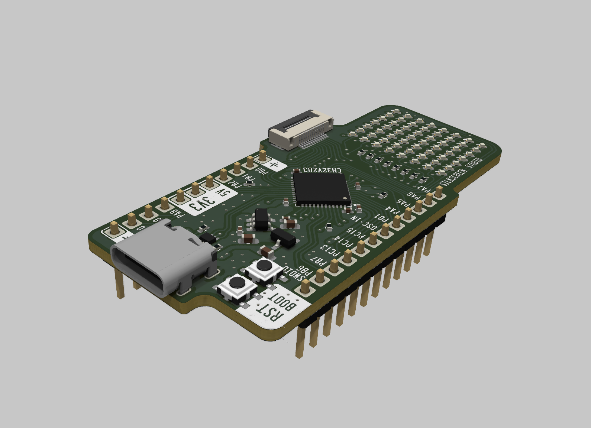
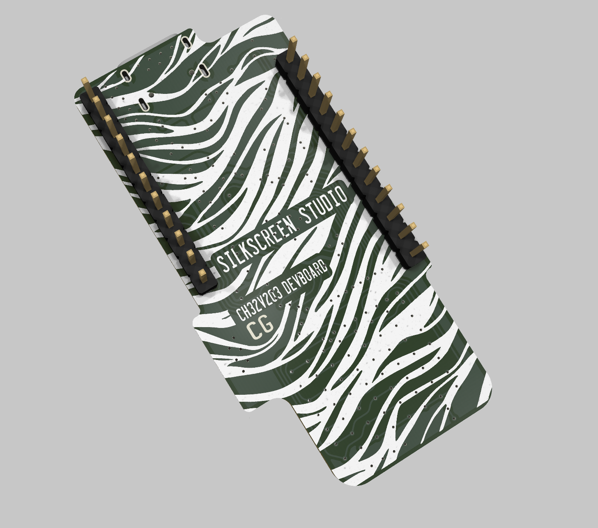
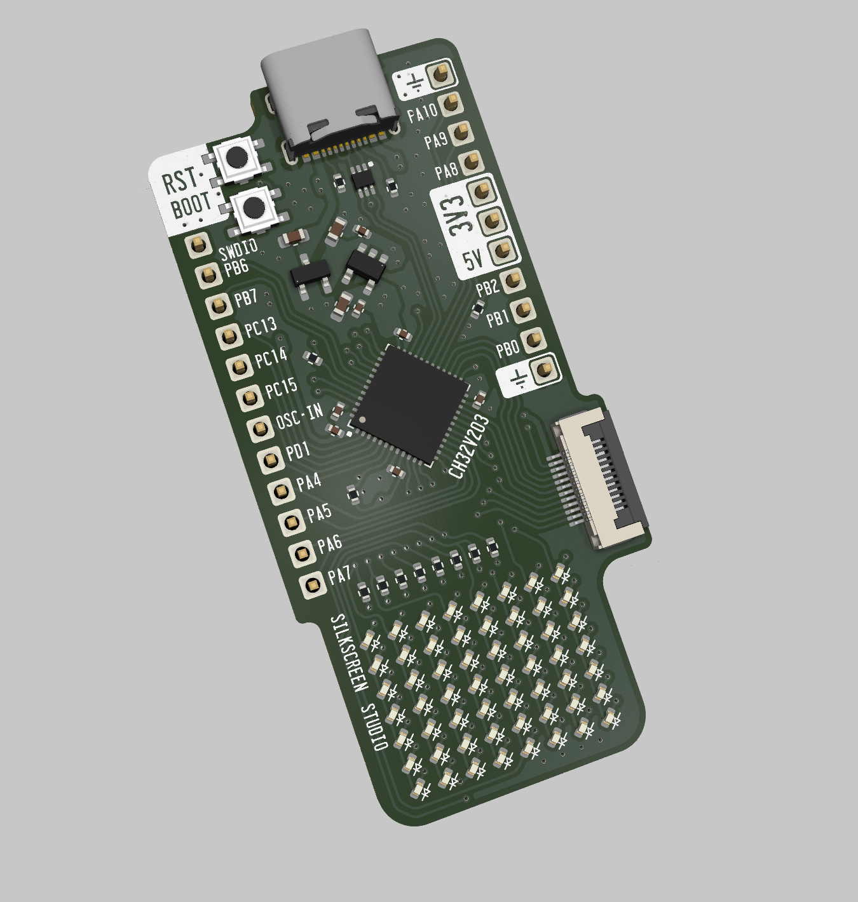

# CH32V203 devboard
A simple CH32V203C8U6 devboard, with a 7x8 charlieplexed matrix and a 12P FPC for IOs, beside the more common 2.54 headers for breadboard compatibility.

# Key features 
 - CH32V203C8U6 MCU:
    - FLASH: 64k
    - SRAM: 20k
    - 144MHz CPU max clock speed
    - 37 GPIOs
    - Many peripherals (4x USART, 2x SPI, 2x I2C, 1x CAN, USB (FS))
    - 9 analog capable GPIOs
    - 12 PWM capable GPIOs
 - 7x8 charlieplexed LED matrix (8 GPIOs)
 - 23x 2.54mm header pins
 - 12P .5mm FPC for breaking out 9 more IOs
 - Boot and Reset Button
 - On board 3.3V LDO `TLV75733PDBVR`, 1A max current
  
  

  
  

# Schematic

# PCB layout

  
  

# Pinout

# BOM

